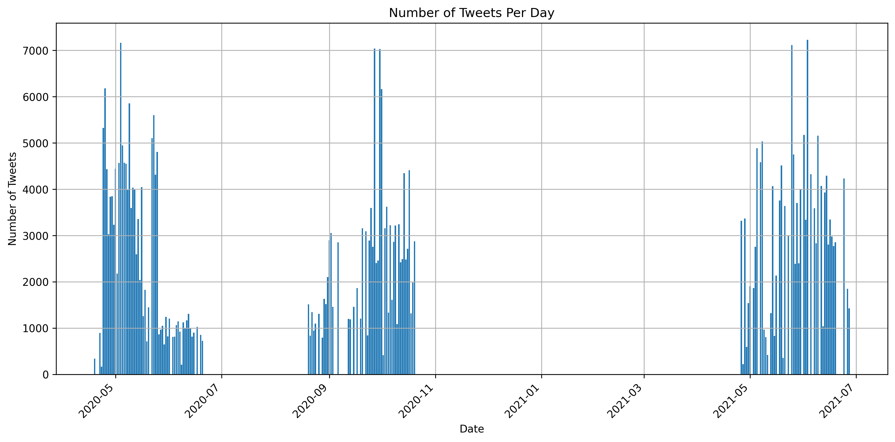
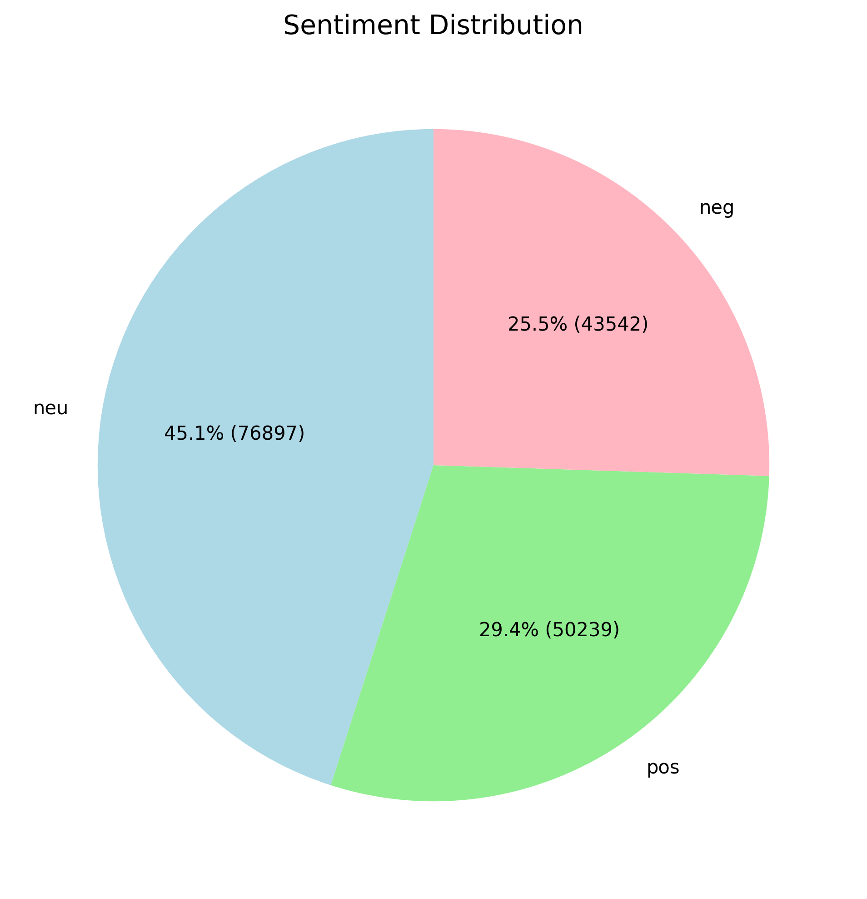
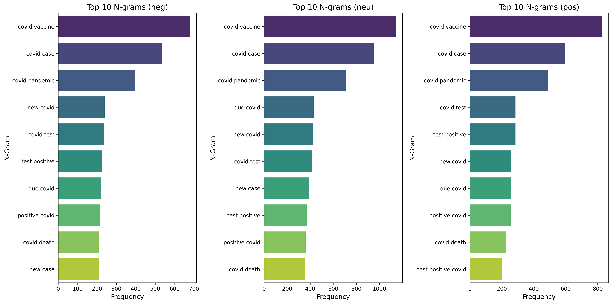
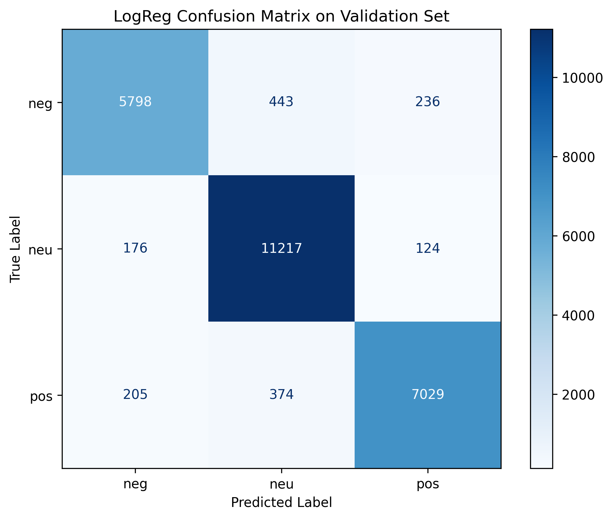
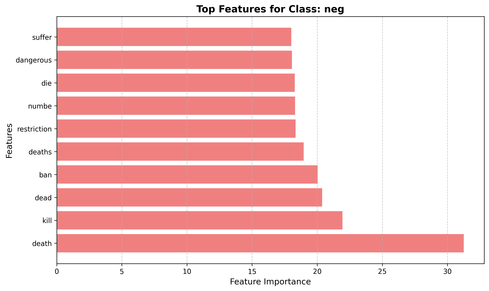
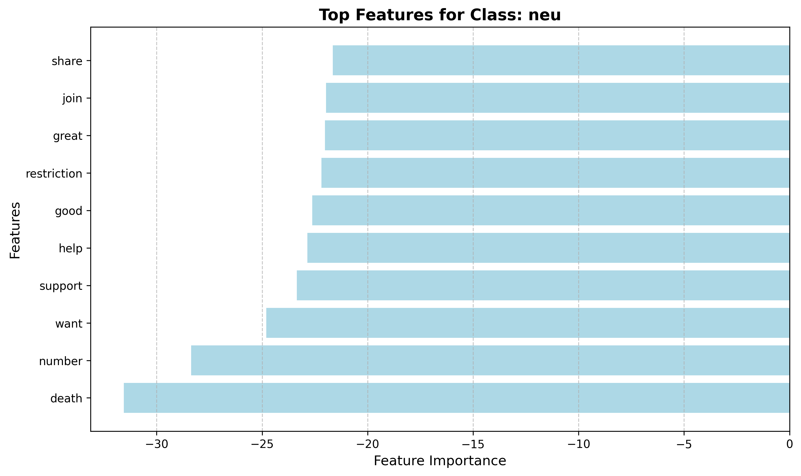
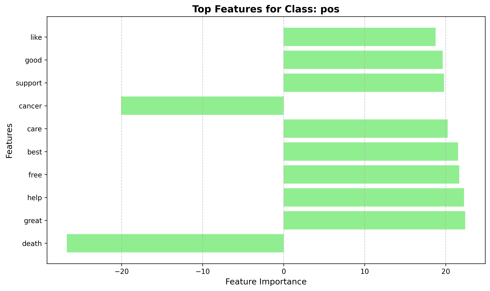

# Readme: Twitter Sentiment Analysis. 

# Table of Contents
- [1. Repository Structure](#1-repository-structure)
- [2. Project Overview](#2-project-overview)
- [3. Business Problem Overview](#3-business-problem-overview)
- [4. Datasets Download Links and Notebook Requirements](#4-datasets-download-links-and-notebook-requirements)
- [5. Dataset EDA and Cleaning](#5-datasets-eda-and-cleaning)
- [6. Data Transformation For Classification](#6-data-transformation-for-classification)
- [7. Modelling](#7-modelling)
- [8. Results](#8-results)
- [9. Conclusion](#9-conclusion)
- [10. Link to Slides](#10-slides)


### 1. Structure.

```plaintext
.
├── data
│   ├── Covid-19 Twitter Dataset (Apr-Jun 2020).csv^^
│   ├── Covid-19 Twitter Dataset (Apr-Jun 2021).csv^^
│   ├── Covid-19 Twitter Dataset (Aug-Sep 2020).csv^^
│   ├── coordinate_cache.json
│   ├── glove.twitter.27B.200d.txt^^^
│   ├── heatmap_city.html^
│   ├── cleaned_text_df.csv
│   ├── location_cache.json
├── Images
│   ├── cm_4.6.png
│   ├── xx_features_4.7.png
│   ├── n-grams_3.1.png
│   ├── sentiment_dist_4.1.png
│   ├── dates_dist_2.7.png
│   └── tf-idf_3.1.png
├── LICENSE
├── model
│   ├── trained_base_model.pkl
│   ├── trained_dt_model.pkl
│   ├── trained_xgb_model.pkl
│   ├── trained_sgd_model.pkl
│   ├── trained_rf_model.pkl^
│   └── trained_model.pkl
├── notebook.ipynb
├── README.md
├── slides.pdf
└── requirements.txt

^ -- Data files saved/uploaded during the notebook execution after lengthy computations (recommended)!
^^ -- Data requires user download.
^^^ -- Data will be downloaded if not present. 
```
# Twitter Sentiment Analysis of Public Reaction to COVID-19 News

## 2. Project Overview 

This project aims to analyze a large dataset of COVID-19-related tweets to understand how public sentiment evolves and spreads in response to news announcements and events. By leveraging natural language processing (NLP) techniques and sentiment analysis models, we seek to gain valuable insights into online conversations surrounding the pandemic dynamics.

**Importance and Motivation:**

Understanding public sentiment during a global crisis like the COVID-19 pandemic is crucial for various stakeholders, including:

- **Public Health Officials:** To gauge public response to health policies and interventions.
- **Media Outlets:** To assess the impact of their news coverage on public perception.
- **Government Agencies:** Monitor public opinion and tailor communication strategies.
- **Researchers:** To study the spread of information and misinformation on social media.

This project contributes to this understanding by providing a comprehensive analysis of Twitter data, revealing trends and patterns in public sentiment related to COVID-19.


## 3. Business Problem and Objectives

**Problem Statement:**

Media outlets and public health organizations need to better understand how their COVID-19-related news and announcements influence public sentiment on Twitter. This project addresses this need by analyzing a large dataset of tweets to identify and track sentiment trends in response to news events.

**Key Questions:**

- How do positive and negative sentiments spread among users following a COVID-19 news announcement?
- What are the key topics and themes associated with different sentiment trends?
- Can we identify any patterns or correlations between news events and changes in public sentiment?

**Project Objectives:**

- To develop a robust NLP pipeline for cleaning, preprocessing, and analyzing Twitter data.
- To apply sentiment analysis models to classify tweets and track sentiment trends over time.
- To visualize and interpret the sentiment analysis results to provide actionable insights.
- To potentially identify key influencers and networks driving sentiment on Twitter.


## 4. Datasets Download Links and Notebook Requirements

**Data Sources:**

1. **Covid-19 Twitter Dataset:** The primary dataset for this Twitter sentiment analysis project is the "Covid-19 Twitter Dataset" available on Kaggle. This dataset contains a large collection of tweets related to COVID-19, including tweet text, user details, location, and sentiment labels.
The dataset can be accessed and downloaded from the following Kaggle page:  [Covid-19 Twitter Dataset](https://www.kaggle.com/datasets/arunavakrchakraborty/covid19-twitter-dataset/data)
You have to download the dataset and extract it into the `Data` directory or upload it into the cloud and directly specify the `data_dir` at the beginning of the 2.5 section of the notebook. 

2. **Pre-trained GloVe embeddings** from Stanford NLP. These word embeddings capture semantic relationships between words and can improve the performance of NLP models, which can be obtained from the [Stanford NLP website](https://nlp.stanford.edu/projects/glove/). The notebook will look for the specific file `glove.twitter.27B.200d.txt` inside the `data_dir`. If the precompiled embedding file is not found, the entire embedding package will be downloaded and extracted. The embedding files are several gigabytes each and upload might take some time.

**Notebook Requirements:**

1. [Required modules](requirements.txt) listed in text file, notebook will download and install required modules based on the list.
2. Execution time can be as long as 2-3 hours, depending on the environment. Highly recommend utilizing the pre-computed coordinate caches and saving the text pre-processing steps, as outlined in the notebook code.
3. Storage required for  pre-computed embeddings is ~2.06 Gb. In addition, heatmap.


## 5. Dataset EDA and Cleaning

**Sections 2.6 - 2.12 Summary**

These sections focus on the initial data exploration, cleaning, and feature extraction steps. The notebook is focused on performing sentiment analysis of tweets related to Covid-19. The main goal of this part of the notebook is to extract relevant data, prepare it, and perform exploratory data analysis (EDA).

Here's a breakdown:

*   **2.6 Basic Data Understanding:** This is the preliminary stage of data exploration, where you would examine the dataset's structure, such as the number of rows and columns (shape), column names, and data types.
*   **2.7 Data Cleaning and EDA: Date:** This section involves extracting date-related information from the tweets and analyzing temporal trends. This could include examining tweet volume over time, identifying peak activity periods.
  
*   **2.8 Data Cleaning and EDA: Language:** Here, the notebook would focus on handling the language aspect of the tweets. This might involve identifying the dominant languages in the dataset, filtering for a specific language (e.g., English), or performing language-specific preprocessing.
*   **2.9 Data Cleaning and EDA: Location:** This step involves working with the location data associated with the tweets. The notebook defines functions to standardize location data (e.g., converting free-form text to city/state/country format), geocode locations to obtain coordinates, and create visualizations on maps. There are also functions to cache the location and coordinate data.
*   **2.10 Data Cleaning and EDA: Source:** This involves identifying and analyzing the different platforms (e.g., Twitter for Android, Twitter for iPhone, Twitter Web App) from which the tweets were posted. The notebook defines a function to extract the source from HTML code.
*   **2.11 Data Cleaning and EDA: Sentiment:** This section deals with the sentiment labels associated with the tweets. The goal here is to explore the distribution of sentiment categories (e.g., positive, negative, neutral) and understand their prevalence in the dataset.
      
*   **2.12 Exploratory Data Analysis (EDA): Social Connections:** The main purpose of this part is to investigate the social connections and interactions within the Twitter data. This will involve analyzing user mentions (who mentions whom), retweets (who retweets whom), and possibly building network graphs to visualize these relationships.

**In essence:** Sections 2.6 through 2.12 are about getting to know the data, cleaning up inconsistencies, and performing basic analysis to start uncovering patterns and insights. In this notebook, there is a special focus on dealing with dates, language, location, and source, which are common challenges in any dataset that involves user-generated content on a social media platform.

## 6. Data Transformation For Classification

**Data Cleaning and Preprocessing:** 
   - Cleaned the raw tweet data by removing noise, special characters, links, mentions, and hashtags.
   - Preprocessed the text data by tokenizing, lemmatizing, and removing stop words.
   - Extracted relevant features for sentiment analysis: used N-grams, Bag-of-Words, GloVe embeddings, TFIDF.
**Top 10 N-Grams By Sentiment: ** 
      
     
**Top 20 TF-IDF:**
      
  
## 7. Modelling 

**Methods**

*Features X: 170.000 x 10200
*Target y: Sentiment Category (Negative, Neutral, Positive).
*Data Split: Train (70%) – Test (15%) – Validate(15%) 

**Sentiment Classification:** 
 - Base model: Logistic Regression, 91% weighted accuracy.
 - Optimization: feature reduction using XGB model's top 1000 feaures.
 - Best model selection: use `GridSearchCV` to establish best parameters.
 - Best model's weighted accuracy: 94%
   
Performance Metric:  weighted presicion.


**Top 10 features for each sentiment:**





## 8. Results

**Sentiment Analysis:**
   - Applied sentiment analysis models to classify tweets as positive, negative, or neutral.
   - Trained and evaluated the performance of different sentiment analysis models.

**Visualization and Interpretation:**
   - Visualized the sentiment analysis results to understand trends and patterns.
   - Interpreted the findings to provide actionable insights.


## 9. Conclusion

**Final Model Evaluation**

 - The model performs reliably across various conditions when faced with new or unseen data. The goal is for the model to remain accurate over time.
 - Model outputs (sentiment classifications, trends, key themes) can be considered reliable for decision-making. Public health officials can use this data to gauge public response to health policies and modify communication strategies accordingly. Media outlets can use it to understand how their coverage is perceived. Influencer Identification: If the model can identify key influencers accurately, this can help organizations target their messages better. Misinformation Spread: The model can detect and identify keywords associated with misinformation spread and address it.

**Future Work**

- Exploring more advanced NLP techniques for sentiment analysis, like BERT embeddings
- Aplpying mode granular sentiment classification
- Using CNN

## 10. Slides

[Slide Deck Here](slides.pdf)


